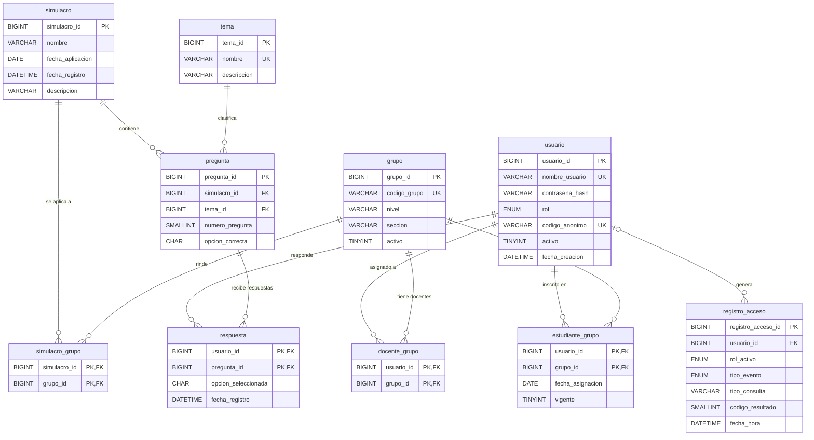

# Modelo de datos

Este modelo se deriva de los componentes y modelos nombrados en `design.md` y de las historias de `requirements.md`. Tiene 10 tablas. Las tablas `usuario`, `simulacro`, `respuesta` y `tema` representan las entidades base; las otras seis se agregan para respaldar explícitamente historias de grupos, preguntas y auditoría.

El diseño indica MySQL en XAMPP, mientras que algunos requisitos describen SQLite/FastAPI y un servidor MCP. El DDL adjunto sigue el destino solicitado para XAMPP: MariaDB/MySQL. La arquitectura y el mecanismo de acceso a la base deben armonizarse antes de implementar.

## 1. Diagrama entidad-relación

## 2. Trazabilidad

| Entidad | Componente propietario de `design.md` | Historia que respalda |
|---|---|---|
| `usuario` | Modelo Usuario; Controlador y Middleware de Autenticación | R1: iniciar sesión, asignar rol y validar permisos; R11: limitar datos personales. |
| `grupo` | Modelo Usuario (extensión para organizar grupos) | R7: reporte del grupo; R8: comprobar que el estudiante pertenece a un grupo docente; R9: resultados agregados por grupo. |
| `docente_grupo` | Modelo Usuario | R1: restringir al docente a sus grupos; R7 y R8: reportes y detalle solo de grupos asignados. |
| `estudiante_grupo` | Modelo Usuario | R7: identificar estudiantes del grupo; R8: comprobar pertenencia; R9: agrupar resultados institucionales. |
| `simulacro` | Modelo Simulacro | R2: procesar un simulacro; R4 y R5: obtener el más reciente y comparar; R7 y R9: seleccionar simulacro para reportes. |
| `simulacro_grupo` | Modelo Simulacro (extensión) | R7.5: listar simulacros disponibles para el grupo; R9.6–R9.7: identificar grupos con o sin resultados para un simulacro. |
| `tema` | Servicio de Cálculos, con datos consultados por Modelo Respuesta | R3: clasificar errores; R6: priorizar temas; R7 y R9: agregar por tema. |
| `pregunta` | Modelo Simulacro y Servicio de Cálculos | R2.5: validar registros; R3.1, R3.3 y R3.5: contar preguntas por tema, excluir temas sin preguntas y calcular aciertos aunque no haya respuesta. |
| `respuesta` | Modelo Respuesta y Servicio de Cálculos | R2 y R3: procesar y clasificar respuestas; R4–R5: reportes y comparación; R7–R9: agregaciones grupales e institucionales. |
| `registro_acceso` | Middleware de Autenticación (extensión de auditoría pendiente en el diseño) | R2.3 y R8.5: registrar fallos de servicio; R11.3–R11.4: auditar consultas e intentos de escritura sin guardar resultados. |

## 3. Tablas adicionales

Las cuatro entidades base (`usuario`, `simulacro`, `respuesta`, `tema`) aparecen en la sección de modelos de datos de `design.md`. Estas seis tablas adicionales se justifican por historias concretas:

| Tabla adicional | Por qué se necesita | Historia |
|---|---|---|
| `grupo` | Identifica los grupos a los que pertenecen estudiantes y docentes. | R7, R8, R9. |
| `docente_grupo` | Un docente puede tener grupos asignados y el sistema debe comprobar esa relación antes de mostrar datos. | R1.6, R7, R8. |
| `estudiante_grupo` | Permite determinar qué estudiantes forman parte de cada grupo al preparar reportes. | R7, R8, R9. |
| `simulacro_grupo` | Registra qué grupos rindieron cada simulacro, incluso si aún no tienen resultados, para listar y excluir grupos correctamente. | R7.5, R9.6–R9.7. |
| `pregunta` | Define el tema y la respuesta correcta de cada pregunta, y permite calcular el denominador del porcentaje de aciertos. | R2.5, R3.1, R3.3, R3.5. |
| `registro_acceso` | Conserva la auditoría solicitada sin almacenar el contenido de resultados individuales. | R2.3, R8.5, R11.3–R11.4. |

No se crean tablas para reportes, porcentajes ni variaciones: se calculan a partir de preguntas y respuestas cuando se solicitan. Así se evita almacenar resultados derivados fuera de la sesión, como indica R3.4.

## 4. Protección de datos (Ley N.º 29733)

| Columna o dato | Medida adoptada |
|---|---|
| `usuario.nombre_usuario` | Usar un nombre de acceso inventado que no contenga nombres, documentos ni datos reales del estudiante. Restringir su consulta al proceso de autenticación. |
| `usuario.contrasena_hash` | Guardar únicamente un hash seguro generado por la aplicación (Argon2id o bcrypt); nunca guardar ni registrar la contraseña original. |
| `usuario.codigo_anonimo` | Asignar un código aleatorio; mostrar este código en reportes en lugar de nombres. Aunque sea seudónimo, protegerlo porque permite relacionar resultados. |
| `usuario.usuario_id` y claves foráneas en relaciones/respuestas | Usarlas solo como identificadores internos. No mostrarlas en las vistas; aplicar control por rol a todas las consultas. |
| `respuesta.opcion_seleccionada` | Tratarla como información educativa vinculada al estudiante; usar solo datos simulados, permitir acceso según rol y no enviarla a servicios externos. |
| `registro_acceso.usuario_id`, `rol_activo`, `tipo_evento`, `tipo_consulta`, `codigo_resultado`, `fecha_hora` | Limitar los campos a auditoría. `tipo_consulta` debe ser una categoría, no el texto libre del usuario. No guardar respuestas, puntajes ni contenido de resultados en el registro. Restringir el acceso y definir un plazo de conservación. |
| Nombres, documentos, teléfonos, correos y otros identificadores directos | No se incluyen en el esquema. Para desarrollo, pruebas y demostraciones se deben usar exclusivamente datos simulados. |

La base de datos no puede garantizar por sí sola que `usuario_id` tenga el rol adecuado para aparecer en `docente_grupo`, `estudiante_grupo` o `respuesta`; el servicio de autenticación debe validar el rol y la pertenencia antes de cada operación. El usuario de conexión usado por la aplicación debe tener solo permisos necesarios; la aplicación no debe permitir escrituras fuera de las operaciones de administración autorizadas.

## 5. Creación

El script [`schema.sql`](schema.sql) crea la base `asistente_cni` con `utf8mb4` y `utf8mb4_unicode_ci`, tablas InnoDB, claves foráneas, índices, restricciones `CHECK` y comentarios con el componente propietario. No contiene datos de prueba, procedimientos almacenados ni triggers.

Para ejecutarlo desde XAMPP, iniciar MySQL/MariaDB y abrir el archivo en phpMyAdmin o ejecutarlo desde el cliente SQL. El DDL asume un MariaDB/MySQL que aplique restricciones `CHECK` (por ejemplo, versiones actuales de XAMPP); confirmar la versión instalada antes de desplegar.