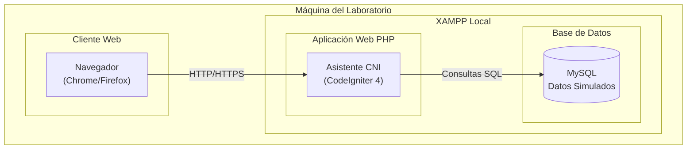
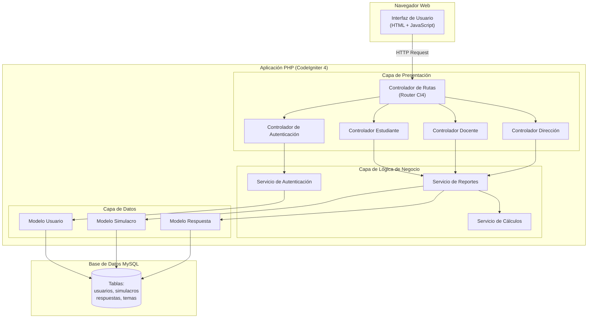
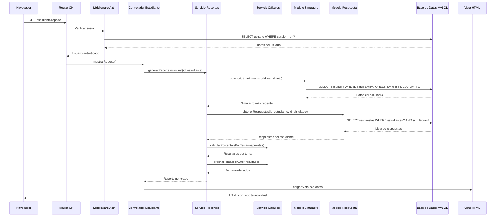
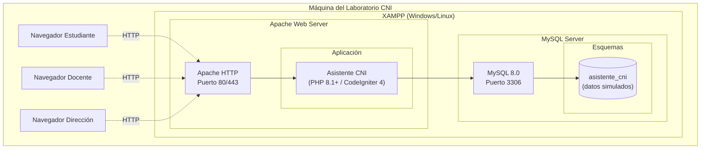

# Documento de Diseño Técnico
## Asistente de Retroalimentación para Simulacros de Admisión (CNI)

---

## Overview

El **Asistente de Retroalimentación para Simulacros de Admisión del CNI** es una aplicación web desarrollada en PHP que automatiza la clasificación y análisis de resultados de simulacros de admisión del Colegio Nacional de Ica. El sistema procesa las respuestas de los estudiantes de 5.º de secundaria, calcula métricas de desempeño por tema y presenta retroalimentación personalizada según tres roles de usuario: Estudiante, Docente y Dirección.

Implementado como un monolito modular por dominio utilizando CodeIgniter 4, el sistema ofrece interfaces web intuitivas que permiten consultar errores por tema, comparar desempeño entre simulacros y generar reportes grupales e institucionales. Todos los datos son simulados conforme a la Ley N.º 29733 de Protección de Datos Personales, asegurando la privacidad de los menores de edad. El despliegue se realiza en servidores locales XAMPP con MySQL como motor de base de datos.

---

## Architecture

## Diagrama C4 Nivel 2 (Contenedores)

---

## Diagrama C4 Nivel 3 (Componentes)

---

## Diagrama de secuencia

### Caso de uso principal: "Estudiante consulta reporte individual"

---

## Diagrama de despliegue

---

## Components and Interfaces

| Componente | Responsabilidad | Carpeta | Historias que satisface |
|---|---|---|---|
| **Controlador de Autenticación** | Gestionar login, logout y validación de credenciales | `app/Controllers/Auth.php` | Req. 1 - Autenticación por rol |
| **Middleware de Autenticación** | Verificar sesión activa en cada request | `app/Filters/AuthFilter.php` | Req. 1 - Control de acceso |
| **Controlador Estudiante** | Manejar requests del rol estudiante | `app/Controllers/Estudiante.php` | Req. 4, 5, 6 - Reportes y comparaciones de estudiante |
| **Controlador Docente** | Manejar requests del rol docente | `app/Controllers/Docente.php` | Req. 7, 8 - Reportes grupales y detalle individual |
| **Controlador Dirección** | Manejar requests del rol dirección | `app/Controllers/Direccion.php` | Req. 9 - Resumen institucional agregado |
| **Servicio de Reportes** | Orquestar generación de todos los reportes | `app/Services/ReporteService.php` | Req. 4, 7, 9 - Lógica común de reportes |
| **Servicio de Cálculos** | Calcular métricas y porcentajes | `app/Services/CalculoService.php` | Req. 3, 5 - Procesamiento y clasificación |
| **Modelo Usuario** | Gestionar datos de usuarios y roles | `app/Models/UsuarioModel.php` | Req. 1 - Autenticación y roles |
| **Modelo Simulacro** | Gestionar datos de simulacros | `app/Models/SimulacroModel.php` | Req. 2, 4 - Procesamiento de simulacros |
| **Modelo Respuesta** | Gestionar respuestas de estudiantes | `app/Models/RespuestaModel.php` | Req. 2, 3 - Clasificación de errores |
| **Vistas HTML** | Presentar interfaces por rol | `app/Views/` | Todas - Interfaz de usuario |
| **JavaScript Frontend** | Interacciones dinámicas y AJAX | `public/assets/js/` | Todas - Experiencia de usuario |

---

## Data Models

El sistema utiliza una base de datos MySQL con datos simulados que incluye las siguientes entidades principales:

- **Usuarios**: Almacena estudiantes, docentes y dirección con sus roles y credenciales
- **Simulacros**: Registra las sesiones de evaluación con fechas y metadatos  
- **Respuestas**: Guarda las respuestas individuales de cada estudiante por simulacro
- **Temas**: Cataloga las áreas temáticas para clasificación de errores

La estructura relacional permite vincular respuestas con estudiantes y simulacros para generar los reportes por tema requeridos por cada rol de usuario.

---

## Punto de extensión para la Unidad 3

En la **Unidad 3**, se integrará un **módulo de conversación** que permitirá a los usuarios formular consultas en lenguaje natural español. Este módulo se conectará como un **controlador adicional** (`app/Controllers/Chat.php`) dentro de la arquitectura existente sin afectar la funcionalidad core.

**Punto de integración previsto:**
- **Ruta**: `/chat` - Endpoint POST para recibir consultas en texto libre
- **Flujo**: El controlador de chat interpretará la intención del usuario y redirigirá internamente a los servicios de reportes existentes
- **Datos**: Utilizará los mismos modelos y servicios ya implementados, manteniendo la consistencia arquitectónica
- **Interfaz**: Se agregará un widget de chat en las vistas existentes sin modificar la navegación principal

Este diseño permite una integración no invasiva del módulo conversacional, manteniendo la separación de responsabilidades y reutilizando toda la lógica de negocio ya desarrollada.

---

## Decisiones no tomadas

Las siguientes decisiones quedan pendientes para el diseño detallado e implementación:

1. **Esquema detallado de base de datos**: Definición exacta de índices, claves foráneas y constraints específicos de MySQL
2. **Estrategia de sesiones**: Implementación específica de manejo de sesiones (archivos, base de datos, o memoria)  
3. **Validaciones de formularios**: Reglas de validación detalladas para cada campo de entrada de datos
4. **Manejo de archivos temporales**: Estrategia para caches de reportes y archivos de trabajo temporal
5. **Logging y auditoría**: Implementación específica del sistema de trazabilidad de accesos requerido por Ley 29733
6. **Configuración de entorno**: Variables de configuración específicas para desarrollo, pruebas y producción
7. **Estrategia de backup**: Procedimientos de respaldo de la base de datos simulada
8. **Optimizaciones de rendimiento**: Índices de base de datos y estrategias de caché para consultas frecuentes
9. **Diseño visual detallado**: Especificaciones de CSS, paleta de colores y elementos de interfaz específicos
10. **Pruebas automatizadas**: Framework y estrategia de testing para validación de funcionalidades