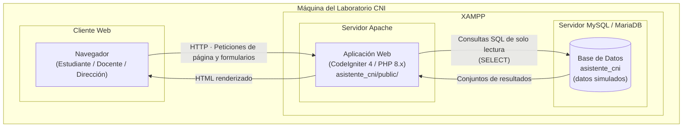
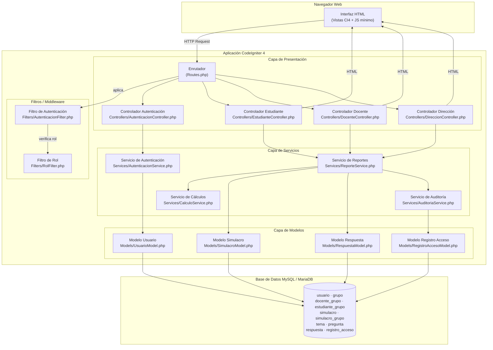
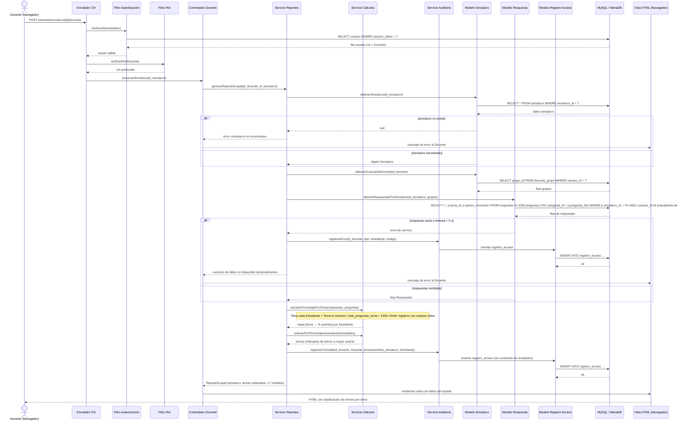
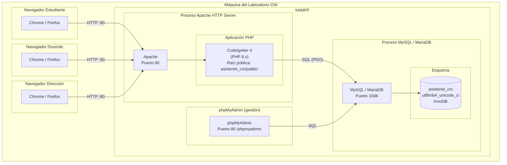

# Documento de Diseño Técnico
## Asistente de Retroalimentación para Simulacros de Admisión — CNI

---

## 1. Visión general

El **Asistente de Retroalimentación para Simulacros de Admisión del CNI** es una aplicación web PHP que automatiza la clasificación de resultados de simulacros de admisión del Colegio Nacional de Ica. Implementado como monolito MVC con CodeIgniter 4 sobre XAMPP (Apache + MySQL/MariaDB), expone tres perfiles de acceso: Estudiante, Docente y Dirección. Cada perfil recibe vistas de retroalimentación ajustadas a su rol: el Estudiante consulta sus errores por tema y compara evolución entre simulacros; el Docente accede a reportes grupales e individuales de sus alumnos; la Dirección visualiza datos agregados por nivel. Todos los datos son simulados conforme a la Ley N.º 29733. El sistema no implementa agente conversacional, modelos de IA ni MCP en esta unidad.

---

## 2. Diagrama C4 Nivel 2 — Contenedores

---

## 3. Diagrama C4 Nivel 3 — Componentes

---

## 4. Diagrama de secuencia — Procesamiento automático de respuestas del simulacro

Caso de uso: **R2 — Un Docente solicita el procesamiento de un simulacro y obtiene la clasificación de errores por tema.**

---

## 5. Diagrama de despliegue

---

## 6. Tabla de componentes

| Componente | Responsabilidad | Carpeta / Archivo | Historias que satisface |
|---|---|---|---|
| **Enrutador** | Define y despacha todas las rutas HTTP de la aplicación hacia el controlador y método correspondiente. | `app/Config/Routes.php` | R1–R11 (punto de entrada de toda solicitud) |
| **Controlador de Autenticación** | Gestionar el flujo de inicio y cierre de sesión; coordinar la verificación de credenciales con el Servicio de Autenticación. | `app/Controllers/AutenticacionController.php` | R1 |
| **Filtro de Autenticación** | Interceptar cada solicitud protegida y rechazarla si el token de sesión es inválido o ha expirado (> 8 h). | `app/Filters/AutenticacionFilter.php` | R1.3, R1.4 |
| **Filtro de Rol** | Verificar que el usuario autenticado posea el rol requerido por la ruta solicitada y rechazar el acceso si no corresponde. | `app/Filters/RolFilter.php` | R1.5, R1.6, R1.7 |
| **Controlador Estudiante** | Recibir las peticiones del rol Estudiante y delegar al Servicio de Reportes la generación del reporte individual, comparación y orientación. | `app/Controllers/EstudianteController.php` | R4, R5, R6 |
| **Controlador Docente** | Recibir las peticiones del rol Docente y coordinar el procesamiento de simulacros, reporte grupal y detalle de estudiante. | `app/Controllers/DocenteController.php` | R2, R3, R7, R8 |
| **Controlador Dirección** | Recibir las peticiones del rol Dirección y solicitar el resumen institucional agregado al Servicio de Reportes. | `app/Controllers/DireccionController.php` | R9 |
| **Servicio de Autenticación** | Verificar credenciales contra la base de datos, generar y revocar tokens de sesión, y devolver el rol asignado. | `app/Services/AutenticacionService.php` | R1.1, R1.2 |
| **Servicio de Reportes** | Orquestar la obtención de datos desde los modelos y coordinar los cálculos para producir reportes individuales, grupales e institucionales. | `app/Services/ReporteService.php` | R2, R4, R7, R9 |
| **Servicio de Cálculos** | Calcular el porcentaje de aciertos por tema, la variación de puntaje entre simulacros y ordenar temas según los criterios de cada reporte. | `app/Services/CalculoService.php` | R3, R5, R6 |
| **Servicio de Auditoría** | Registrar en `registro_acceso` cada consulta ejecutada y cada error de servicio, sin persistir el contenido de los resultados. | `app/Services/AuditoriaService.php` | R2.3, R8.5, R11.3, R11.4 |
| **Modelo Usuario** | Encapsular todas las consultas SQL sobre las tablas `usuario`, `grupo`, `docente_grupo` y `estudiante_grupo`. | `app/Models/UsuarioModel.php` | R1, R7, R8 |
| **Modelo Simulacro** | Encapsular las consultas sobre `simulacro`, `simulacro_grupo` y `pregunta`. | `app/Models/SimulacroModel.php` | R2, R4, R7, R9 |
| **Modelo Respuesta** | Encapsular las consultas sobre `respuesta` unidas a `pregunta` y `tema`. | `app/Models/RespuestaModel.php` | R2, R3, R4, R5, R7, R8, R9 |
| **Modelo Registro Acceso** | Encapsular la inserción de filas en `registro_acceso`. | `app/Models/RegistroAccesoModel.php` | R11.3, R11.4 |
| **Vistas por rol** | Renderizar en el servidor las páginas HTML de login, reporte individual, reporte grupal, detalle de estudiante y resumen institucional. | `app/Views/autenticacion/`, `app/Views/estudiante/`, `app/Views/docente/`, `app/Views/direccion/` | R1–R9 (presentación de resultados) |

---

## 7. Punto de extensión para la Unidad 3

En la Unidad 3 se conectará un **agente conversacional** que permita a los usuarios formular consultas en lenguaje natural en español.

**Dónde se conectará — sin diseñarlo todavía:**

- Se añadirá una ruta `POST /chat` que recibirá el texto libre del usuario.
- El nuevo controlador que atienda esa ruta consumirá los mismos servicios ya existentes (`ReporteService`, `CalculoService`) para obtener los datos de respuesta; no duplicará lógica de negocio.
- La interpretación de la intención de la consulta y la generación de la respuesta en lenguaje natural quedan fuera del alcance de esta unidad y serán diseñadas en la Unidad 3.
- Los modelos, el esquema de base de datos y los filtros de rol permanecen inalterados; el agente opera como un cliente más de la capa de servicios.
- Ningún identificador de estudiante ni resultado de simulacro se enviará a servicios externos: la restricción del steering se mantiene vigente.

> **Límite explícito:** este documento no diseña el agente, no selecciona la API externa ni define el protocolo de integración. Solo declara el punto de acoplamiento.

---

## 8. Decisiones no tomadas

Las siguientes decisiones quedan pendientes para el diseño detallado o para sesiones posteriores:

1. **Versión concreta de CodeIgniter 4 y compatibilidad con XAMPP** — marcada `[VERIFICAR EN SEMANA 7]` en ADR-001.
2. **Mecanismo de sesiones** — archivos del sistema de ficheros, base de datos o caché; ninguna opción ha sido evaluada todavía.
3. **Reglas de validación de formularios** — tipos de campo, longitudes máximas, expresiones regulares y mensajes de error por campo.
4. **Algoritmo de hash de contraseñas** — ADR-002 y R11 exigen hash seguro; la elección entre Argon2id y bcrypt, y su configuración de coste, queda pendiente.
5. **Política de expiración y rotación de tokens de sesión** — R1.4 fija 8 horas, pero no se ha decidido si el token se rota en cada solicitud ni cómo se revoca al cerrar sesión.
6. **Implementación del log de auditoría** — R11.3 exige registrar consultas; la estructura exacta de `tipo_consulta`, el nivel de detalle y el periodo de retención no están definidos.
7. **Índices de base de datos y estrategia de rendimiento** — los requisitos de tiempo (R2: < 5 s; R7: < 10 s; R9: < 15 s) no se han validado con el volumen de datos simulados.
8. **Configuración de entornos** — variables de `.env` para desarrollo, pruebas y demostración; el archivo `.env.example` deberá completarse antes de la semana 7.
9. **Diseño visual y accesibilidad** — paleta de colores, tipografía, layout responsivo y cumplimiento WCAG mínimo no han sido especificados.
10. **Estrategia de pruebas automatizadas** — framework (PHPUnit, Pest) y cobertura mínima aceptable no definidos; la ejecución sobre XAMPP tampoco está probada.
11. **Protocolo y credenciales de conexión a MySQL** — puerto, usuario de aplicación, permisos mínimos y nombre del esquema definitivo están marcados `[VERIFICAR EN SEMANA 7]` en ADR-002.
12. **Diseño del agente conversacional y su integración con servicios externos** — aplazado explícitamente a la Unidad 3 (ver sección 7).
