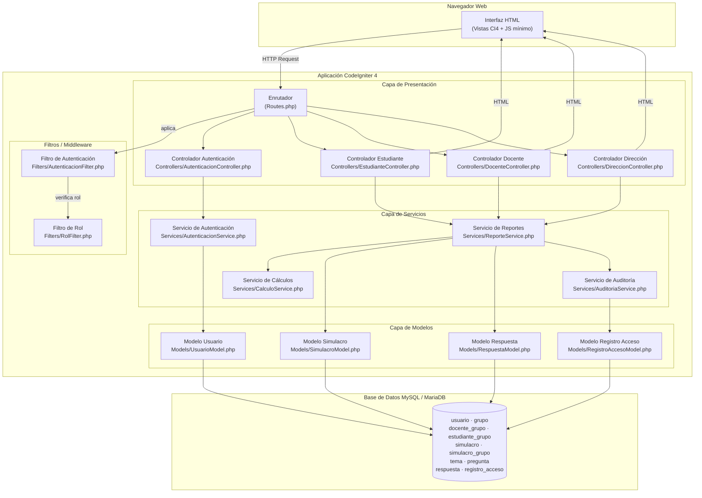

# Asistente de Retroalimentación para Simulacros de Admisión — CNI

**Versión:** v1 — Semana 6
**Fecha:** 2026-10-09

## C4 Nivel 3 — Componentes

```mermaid
flowchart TB
    subgraph NavegadorWeb["Navegador Web"]
        InterfazHTML["Interfaz HTML\n(Vistas CI4 + JS mínimo)"]
    end

    subgraph AplicacionCI4["Aplicación CodeIgniter 4"]

        subgraph CapaPresentacion["Capa de Presentación"]
            Rutas["Enrutador\n(Routes.php)"]
            CtrlAuth["Controlador Autenticación\nControllers/AutenticacionController.php"]
            CtrlEstudiante["Controlador Estudiante\nControllers/EstudianteController.php"]
            CtrlDocente["Controlador Docente\nControllers/DocenteController.php"]
            CtrlDireccion["Controlador Dirección\nControllers/DireccionController.php"]
        end

        subgraph CapaFiltros["Filtros / Middleware"]
            FiltroAuth["Filtro de Autenticación\nFilters/AutenticacionFilter.php"]
            FiltroRol["Filtro de Rol\nFilters/RolFilter.php"]
        end

        subgraph CapaServicios["Capa de Servicios"]
            SvcAuth["Servicio de Autenticación\nServices/AutenticacionService.php"]
            SvcReporte["Servicio de Reportes\nServices/ReporteService.php"]
            SvcCalculo["Servicio de Cálculos\nServices/CalculoService.php"]
            SvcAuditoria["Servicio de Auditoría\nServices/AuditoriaService.php"]
        end

        subgraph CapaDatos["Capa de Modelos"]
            ModeloUsuario["Modelo Usuario\nModels/UsuarioModel.php"]
            ModeloSimulacro["Modelo Simulacro\nModels/SimulacroModel.php"]
            ModeloRespuesta["Modelo Respuesta\nModels/RespuestaModel.php"]
            ModeloRegistro["Modelo Registro Acceso\nModels/RegistroAccesoModel.php"]
        end

    end

    subgraph BDMySQL["Base de Datos MySQL / MariaDB"]
        Tablas[("usuario · grupo\ndocente_grupo · estudiante_grupo\nsimulacro · simulacro_grupo\ntema · pregunta\nrespuesta · registro_acceso")]
    end

    InterfazHTML -- "HTTP Request" --> Rutas
    Rutas -- "aplica" --> FiltroAuth
    FiltroAuth -- "verifica rol" --> FiltroRol
    Rutas --> CtrlAuth
    Rutas --> CtrlEstudiante
    Rutas --> CtrlDocente
    Rutas --> CtrlDireccion

    CtrlAuth --> SvcAuth
    CtrlEstudiante --> SvcReporte
    CtrlDocente --> SvcReporte
    CtrlDireccion --> SvcReporte

    SvcAuth --> ModeloUsuario
    SvcReporte --> SvcCalculo
    SvcReporte --> ModeloSimulacro
    SvcReporte --> ModeloRespuesta
    SvcReporte --> SvcAuditoria
    SvcAuditoria --> ModeloRegistro

    ModeloUsuario --> Tablas
    ModeloSimulacro --> Tablas
    ModeloRespuesta --> Tablas
    ModeloRegistro --> Tablas

    CtrlEstudiante -- "HTML" --> InterfazHTML
    CtrlDocente -- "HTML" --> InterfazHTML
    CtrlDireccion -- "HTML" --> InterfazHTML
```
